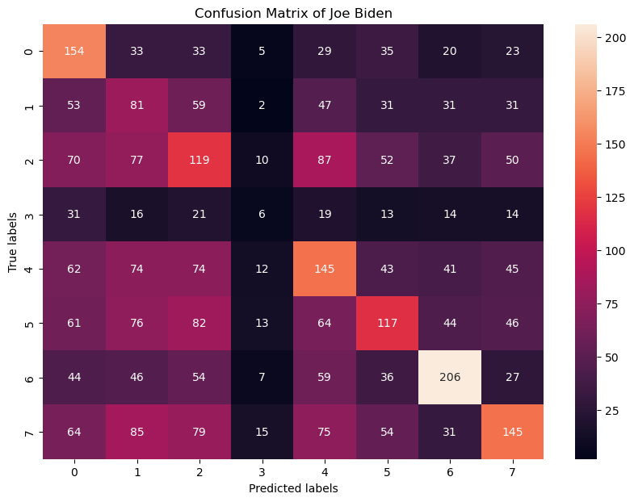
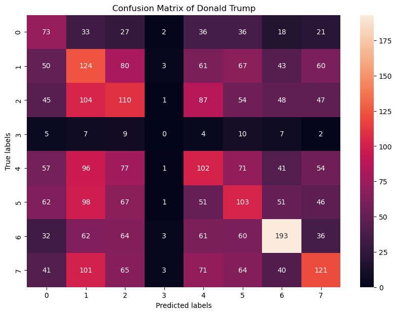
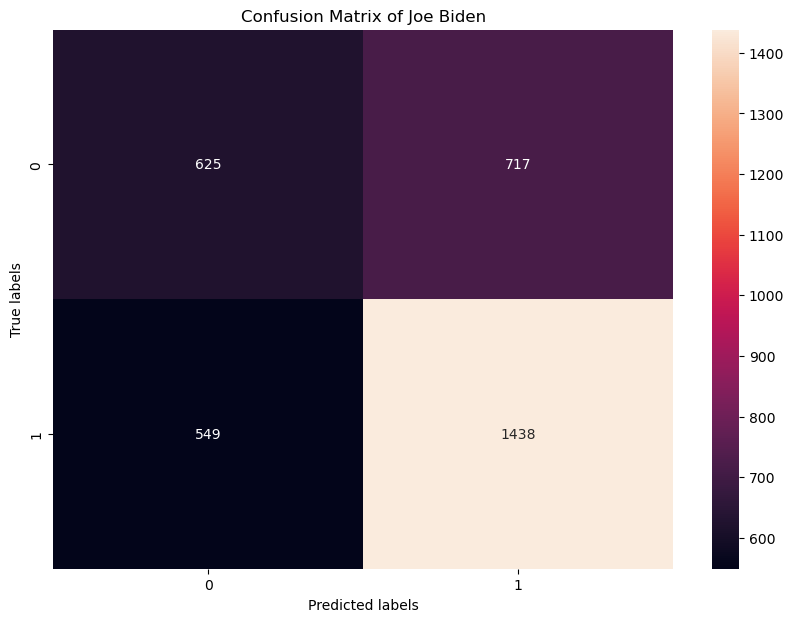
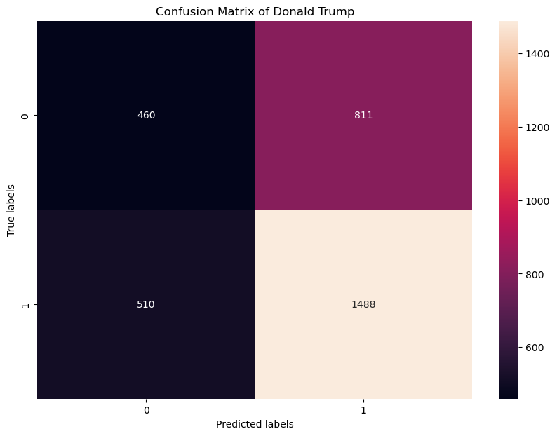
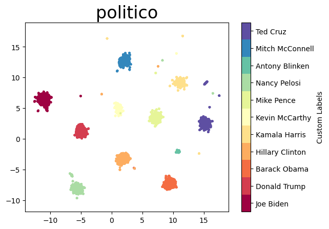
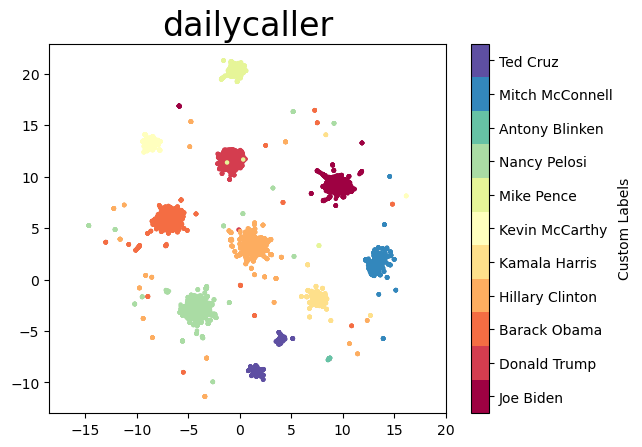
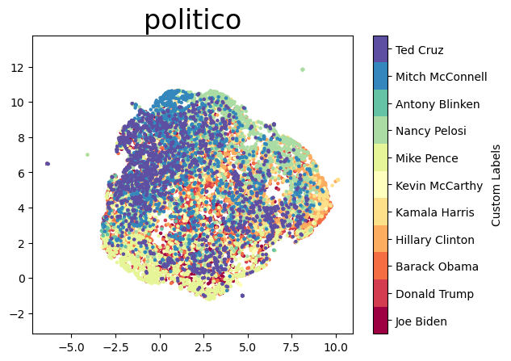
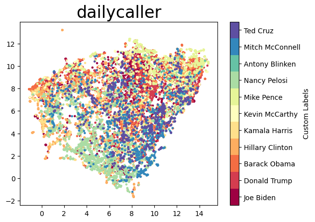
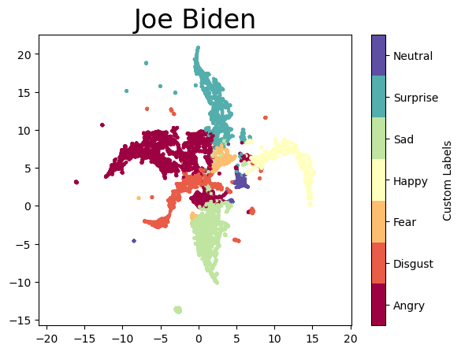
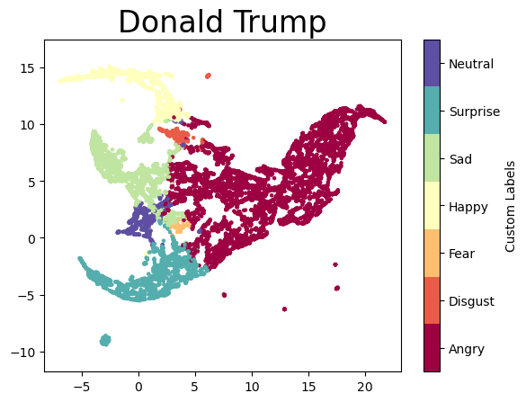

# Politician Image Project
Build up models to recognize the politicians in images from news websites.


### Install Packages
```
pip install numpy matplotlib pandas torch Pillow requests beautifulsoup4 facenet_pytorch rmn torchvision scikit-learn pickle-mixin tqdm
```
  
where 
  <ul>
  <li><code>facenet_pytorch</code> (<a href="https://github.com/timesler/facenet-pytorch">source</a>)): Key module for facial detection and recognition. </li>
  <li><code>rmn</code> (<a href="https://github.com/phamquiluan/ResidualMaskingNetwork">source</a>)): Key module for facial expression detection. </li>
  <li><code>request beautifulsoup4</code>: Extract content (links, texts, images) from website. </li>
  <li><code>scikit-learn</code>: K Nearest Neighbour classifier.</li>
  <li><code>pickle-mixin</code>: Save sklearn model.</li>
  </ul>


## Dataset
https://drive.google.com/file/d/1QWZ5JAdihzDzdTQX2Xjk4rFNm_ixurz7/view?usp=drive_link

## Analyze and processing the dataset
```
$ python analyze_image_dataset.py
```
Rename the columns. Delete lines with no URLs, invalid URLs, or duplicates.<br>
Determine the source corporation of each row by analyzing the URLs. Remove the rows from invalid or non-media corporation.

We determine the source corporation of a sample by the second-level domain of url. \
e.g. ht<span></span>tps://static.__politico__.com/c3/6e/45e01ef84890a8cf62801cfae41d/160504-ted-cruz-1-gty-1160.jpg \
&nbsp;&nbsp;&nbsp;&nbsp;&nbsp;&nbsp;     https://**dailycaller**.com/wp-content/uploads/2018/07/Michael-Ian-Black-Twitter-4.jpg


After processing, the sample size of dataset is **842232**, where the number of samples from each corporation is:
| Corporation     | Sample Size |
|-----------------|-------------|
| Politico        | 312213      |
| DailyCaller     | 145019      |
| WashTimes       | 104420      |
| FoxNews         | 96558       |
| Breitbart       | 81152       |
| NPR             | 76385       |
| CNN             | 21401       |
| APNews          | 4658        |
| PoliticoPro     | 235         |
| FoxBusiness     | 144         |
| TheHill         | 21          |
| WP              | 13          |
| TimesOfIsrael   | 3           |
| Mediaite        | 2           |
| WSJ             | 1           |
| JNS             | 1           |
| JPost           | 1           |
| AFP             | 1           |
| WashingtonTimes | 1           |


## Facenet Model preparation

### Steps
1. Prepare another labelled dataset:<br>
   Extract names and relevant image urls of politicians from the three Wikimedia sites:
   <ul>
     <li><a href="https://commons.wikimedia.org/wiki/Category:21st-century_male_politicians_of_the_United_States">Category:21st-century male politicians of the United States</a></li>
     <li><a href="https://commons.wikimedia.org/wiki/Category:21st-century_female_politicians_of_the_United_States">Category:21st-century female politicians of the United States</a></li>
     <li><a href="https://commons.wikimedia.org/w/index.php?title=Category:21st-century_businesspeople_from_the_United_States&oldid=527515279">Category: 21st-century businesspeople from the United States</a></li>
   </ul>

   and two Wikiopedia sites:
   <ul>
     <li><a href="https://en.wikipedia.org/w/index.php?title=Category:21st-century_American_politicians&oldid=1015022478">Category:21st-century American politicians</a></li>
     <li><a href="https://en.wikipedia.org/w/index.php?title=Category:21st-century_American_businesspeople&oldid=1110690935">Category:21st-century American businesspeople</a></li>     
   </ul>

Specifically, for each personal page from Wikipedia, first check if this person has wikimedia page, and get images from wikimedia page if possible. Otherwise, take the portrait link from the Wikipedia page if there is.

```
$ python Image_URLs.py
```

This execution takes around 48 hours, producing a map "name -> list of image urls" and storing as <code>name_img_url.pt</code> (around 61 MB), which includes 312587 urls from 20707 (in particular, 10094 non-empty) persons.<br>
This file is included in the repository. 


2. For the images from <code>name_img_url.pt</code>, implementing the <code>facenet</code> functions to get embedding vectors of faces.<br>
To reduce the execution time, for each person, we take at most 10 faces embedding vectors to this dataset, where one of which are from the portrait.
```
$ python Embedding_Faces.py
```
This execution takes around 9 hours, storing the labelled vectors as <code>name_embd.pt</code> (around 1.3 GB), which includes 37934 embedding face vectors from 9308 politicians.<br>
You may also download this file from https://drive.google.com/file/d/1SLuR20JKkM4EgpwZWJkGkSI3LXy0eBkc/view?usp=share_link

3. Using K-nearest neighbour classifier (with K=1) to produce a model for the labelled vectors.
```
$ python prepare_KNN_model.py
```


### Evaluation
1. Evaluate the performance of <code>facenet</code> model with the dataset <code>name_embd.pt</code>.
   Split the train, test set at a ratio 8:2, and then train a K-nearest neighbour classifier (with K=1) model.<br>
```
$ python Evaluate_name_embd.py
```
Output:
```
>>> The prediction accuracy of name_embd dataset through 1-nearest-neighbor is 0.8059839198629234.
```


2. Test the model using a single url:

#### Example 1:
We are interesting in the two persons from the image as follows <br>
<figure>

  <em>https://www.politico.com/dims4/default/210ea62/2147483647/strip/true/crop/700x400+0+0/resize/630x360!/quality/90/?url=https%3A%2F%2Fstatic.politico.com%2Fcapny%2Fsites%2Fdefault%2Ffiles%2Fa-Kirsten%20Gillibrand-Chuck%20Schumer_0.png</em>
</figure>

```
$ python test_url.py
```

Input:
```
>>> https://www.politico.com/dims4/default/210ea62/2147483647/strip/true/crop/700x400+0+0/resize/630x360!/quality/90/?url=https%3A%2F%2Fstatic.politico.com%2Fcapny%2Fsites%2Fdefault%2Ffiles%2Fa-Kirsten%20Gillibrand-Chuck%20Schumer_0.png
```

Output:
```
>>> Recognized {'Kirsten Gillibrand', 'Charles Schumer'} in the image.
```
which are exactly the names of the two politicians.


#### Example 2
<figure>

  <em>US President <b>Donald Trump</b>, flanked by (from R) Response coordinator for White House Coronavirus Task Force <b>Deborah Birx</b>, US Treasury Secretary <b>Steven Mnuchin</b>, US Vice President <b>Mike Pence</b> and Director of the National Institute of Allergy and Infectious Diseases <b>Anthony Fauci</b>, speaks during the daily briefing on the novel coronavirus, COVID-19, in the Brady Briefing Room at the White House on March 25, 2020, in Washington, DC.</em>
</figure>

Input:
```
>>> https://media.cnn.com/api/v1/images/stellar/prod/200505150639-02-coronavirus-task-force-briefing-0325.jpg?q=x_0,y_156,h_1688,w_3000,c_crop/w_800
```
Output:
```
>>> Recognized {'Vicki Marble', 'Donald Trump', 'Mike Pence', 'Mike Gravel', 'Steven Mnuchin'} in the image.
```
Notice that 'Donald Trump', 'Mike Pence', 'Steven Mnuchin' are correctly predicted, while the other two failed, as they are not included in the dataset.

## Facial Expression Recognition (FER) model

### Source:
<a href="https://github.com/phamquiluan/ResidualMaskingNetwork">Residual Masking Network</a> from <a href="https://github.com/phamquiluan">Luan Pham</a>.


Implementing Residual Masking Network (RMN) for expression detection. Achieving 77% accuracy from <a href="https://www.kaggle.com/datasets/msambare/fer2013">FER2013</a> dataset.

For a face image, this model returns a logit vector of length 7, stands for <code>['Angry', 'Disgust', 'Fear', 'Happy', 'Sad', 'Surprise', 'Neutral']</code> expressions. We can then apply softmax function to get the corresponding probability.


## Obtain expression data from the Image Dataset with prompts.
To get the emotion logits of some specific person, we need to execute
```
$ python name_emotion.py
```
Input the exact names of a person (should be included in `name_embd.pt`).\
Notice that some person may have multiple exact names, e.g. "Hillary Clinton" and "Hillary Rodham Clinton". That's because of the different titles between Wikipedia and Wikimedia. In this case, we need to enter all "exact names":
```
>>> Hillary Clinton
>>> Hillary Rodham Clinton
>>>
```
Then input the prompts (parts of name is an intuitive choice)
```
>>> Clinton
>>> Hillary
>>>
```

Finally, input the maximum number of samples we grabbed from each corporation. 2,000 by default.
```
>>>
```

This program analyzes the samples whose texts (Title, Caption or Text) contain these prompts. 

Then for each of the corporation <code>[["foxnews", "foxbusiness"], ["cnn"], ["washtimes", "washingtontimes"], ["dailycaller"],["politico", "politicopro"], ["breitbart"], ["npr"], ['apnews']]</code>, for each filtered sample, the program determines whether or not the person is in the photos with the KNN-model <code>model.sav</code>. and if so, passing the square-cropped face to the emotion recognition model <code>RMN</code>, and get the logit vector. 

Store the results in <code>politician_emotions_corporation.pt</code>.


### Theoretical Accuracy of identity recognition through KNN model:
#### Case 1: Without the usage of prompt:

For a face image, let $F$ be the actual name of this face, $P$ be the predicted name from the KNN model, $`D_n`$ stands for "the name is included in the KNN model". 
We are interested in $P(F = n | P = n)$, that is, the conditional probability of a name is actual given it is predicted from the model.

According to the Bayesian Theorem:

$$ 
\begin{align}
&P(F = n | P = n) \\
&= P(F = n | P = n, D_n) \\
&= \frac{P(P = n | F = n, D_n)  P(F = n|D_n)}{P(P = n | F = n, D_n)  P(F = n|D_n) + P(P = n | F \neq n, D_n) P(F \neq n|D_n)}
\end{align}
$$

where
<ul>
<li>$P(P = n | F = n, D_n)$: The prediction accuracy of the model. Estimated 0.95.  </li>
<li>$P(P = n | F \neq n, D_n)$: Probability that the actual name is not $n$, but predict $n$. Use the $\frac{1}{9905}$ (probability of arbitrary choice) as estimation. </li>
<li>$P(F = n|D_n)$: The frequency of that name $n$ appearing in the image dataset.</li>  
</ul>
Here are some pairs:

| $P(F=n\|D_n)$ | $P(F=n\|P=n)$ |
|-----------------|---------------|
| 0.01            | 0.989         |
| 0.001           | 0.904         |
| 0.0001          | 0.485         |

That is, for the politicians who don't make the news much, we have a high chance of mistaken prediction.


#### Case 2: With the usage of prompts:
Let $T_n$ stands for the prompts corresponding to person $n$, and in this case we are interesting in $P(F = n | P = n, T_n)$.

Notice that conditional on the true name $F$, the prediction $P$ and the prompt $T$ are independent.

$$ 
\begin{align}
&P(F = n | P = n, T_n) \\
&= P(F = n | P = n, T_n, D_n) \\
&= \frac{P(P = n | F = n, T_n, D_n)  P(F = n|T_n, D_n)}{P(P = n | F = n,T_n, D_n)  P(F = n|T_n, D_n) + P(P = n | F \neq n,T_n, D_n) P(F \neq n|T_n, D_n)}\\
&= \frac{P(P = n | F = n, D_n)  P(F = n|T_n, D_n)}{P(P = n | F = n, D_n)  P(F = n|T_n, D_n) + P(P = n | F \neq n, D_n) P(F \neq n|T_n, D_n)}
\end{align}
$$

where

$P(F = n|T_n, D_n)$: The probability of the appearance of $n$ given the corresponding prompts of $n$.

Empirically, this is much larger than the $P(F = n|D_n)$.

With the usage of prompts, we still need to analyze the "famous" people in the dataset, because:
<ul>
  <li> With the restriction of prompts $T_n$, the number of samples is even lower for non-famous people.</li>
  <li> As $P(F = n|T_n, D_n) \propto P(T_n|F=n, D_n) P(F=n|D_n)$, the frequency $P(F=n|D_n)$ could not be too small.</li>
</ul>


## Evaluation and Result
We tested some famious politicians. Namely <code>['Joe Biden', 'Donald Trump', 'Barack Obama', 'Hillary Clinton', 'Kamala Harris', 'Kevin McCarthy', 'Mike Pence', 'Nancy Pelosi', 'Antony Blinken', 'Mitch McConnell', 'Ted Cruz']</code>

For each person, we have a dataset of emotion logits with eight media corporations as labels. 


### Build classification model for each politician
Then we implement a KNN classifier with k=5 and test the prediction accuracy, and compare with the baseline model (random guessing or naive majority prediction).

```
$ python evaluate_name_emotions.py
```
Input the mode.
```
>>> 1
```

#### Part of results
```
Now analyzing the emotion from Joe Biden
cnn
Number of Samples: 1303
Average emotion: [0.4868, 0.0964, 0.0553, 0.0093, 0.2243, 0.0675, 0.0605]
Dominate Emotion: Angry
npr
Number of Samples: 1467
Average emotion: [0.4454, 0.0614, 0.0525, 0.0257, 0.2236, 0.1120, 0.0794]
Dominate Emotion: Angry
politico
Number of Samples: 2000
Average emotion: [0.4887, 0.0570, 0.0527, 0.0232, 0.1935, 0.1114, 0.0735]
Dominate Emotion: Angry
apnews
Number of Samples: 546
Average emotion: [0.4822, 0.0561, 0.0502, 0.0437, 0.1817, 0.1297, 0.0564]
Dominate Emotion: Angry
washtimes
Number of Samples: 2000
Average emotion: [0.4091, 0.0488, 0.0647, 0.0275, 0.2084, 0.1667, 0.0747]
Dominate Emotion: Angry
dailycaller
Number of Samples: 2000
Average emotion: [0.4366, 0.0652, 0.0699, 0.0267, 0.2250, 0.1064, 0.0702]
Dominate Emotion: Angry
foxnews
Number of Samples: 2000
Average emotion: [0.3913, 0.0637, 0.0469, 0.0208, 0.2731, 0.1057, 0.0985]
Dominate Emotion: Angry
breitbart
Number of Samples: 2000
Average emotion: [0.4200, 0.0365, 0.0587, 0.0392, 0.2160, 0.1572, 0.0724]
Dominate Emotion: Angry
Baseline (naive choice) accuracy is 0.15019525382997898
Prediction Accuracy of KNN classification: 0.307299489336137


Now analyzing the emotion from Donald Trump
cnn
Number of Samples: 912
Average emotion: [0.8125, 0.0050, 0.0066, 0.0019, 0.0737, 0.0363, 0.0639]
Dominate Emotion: Angry
npr
Number of Samples: 2000
Average emotion: [0.6883, 0.0080, 0.0110, 0.0067, 0.1259, 0.0629, 0.0971]
Dominate Emotion: Angry
politico
Number of Samples: 2000
Average emotion: [0.7194, 0.0082, 0.0118, 0.0047, 0.0962, 0.0783, 0.0815]
Dominate Emotion: Angry
apnews
Number of Samples: 162
Average emotion: [0.7083, 0.0074, 0.0132, 0.0043, 0.1559, 0.0420, 0.0689]
Dominate Emotion: Angry
washtimes
Number of Samples: 2000
Average emotion: [0.7324, 0.0094, 0.0097, 0.0059, 0.0944, 0.0691, 0.0792]
Dominate Emotion: Angry
dailycaller
Number of Samples: 2000
Average emotion: [0.7239, 0.0120, 0.0111, 0.0085, 0.1143, 0.0533, 0.0769]
Dominate Emotion: Angry
foxnews
Number of Samples: 2000
Average emotion: [0.7056, 0.0062, 0.0072, 0.0073, 0.0915, 0.0664, 0.1158]
Dominate Emotion: Angry
breitbart
Number of Samples: 2000
Average emotion: [0.6903, 0.0109, 0.0095, 0.0100, 0.1630, 0.0313, 0.0851]
Dominate Emotion: Angry
Baseline (naive choice) accuracy is 0.15297537096527458
Prediction Accuracy of KNN classification: 0.25512389109819517


Now analyzing the emotion from Barack Obama
cnn
Number of Samples: 293
Average emotion: [0.3968, 0.0138, 0.0091, 0.0415, 0.2488, 0.0687, 0.2213]
Dominate Emotion: Angry
npr
Number of Samples: 674
Average emotion: [0.4344, 0.0155, 0.0091, 0.0750, 0.2084, 0.0607, 0.1968]
Dominate Emotion: Angry
politico
Number of Samples: 2000
Average emotion: [0.4685, 0.0195, 0.0105, 0.0572, 0.2022, 0.0639, 0.1783]
Dominate Emotion: Angry
apnews
Number of Samples: 25
Average emotion: [0.1158, 0.0152, 0.0097, 0.7634, 0.0242, 0.0580, 0.0137]
Dominate Emotion: Happy
washtimes
Number of Samples: 1285
Average emotion: [0.4368, 0.0223, 0.0105, 0.0742, 0.2224, 0.0599, 0.1739]
Dominate Emotion: Angry
dailycaller
Number of Samples: 1843
Average emotion: [0.3909, 0.0197, 0.0092, 0.0969, 0.2324, 0.0508, 0.2001]
Dominate Emotion: Angry
foxnews
Number of Samples: 524
Average emotion: [0.4711, 0.0145, 0.0069, 0.0528, 0.2051, 0.0486, 0.2010]
Dominate Emotion: Angry
breitbart
Number of Samples: 315
Average emotion: [0.5388, 0.0195, 0.0103, 0.1016, 0.1346, 0.0626, 0.1327]
Dominate Emotion: Angry
Baseline (naive choice) accuracy is 0.28739761459979885
Prediction Accuracy of KNN classification: 0.385632183908046


Now analyzing the emotion from Hillary Clinton
cnn
Number of Samples: 444
Average emotion: [0.0884, 0.0046, 0.0259, 0.3023, 0.1549, 0.2580, 0.1659]
Dominate Emotion: Happy
npr
Number of Samples: 661
Average emotion: [0.0551, 0.0038, 0.0268, 0.4754, 0.0974, 0.2636, 0.0779]
Dominate Emotion: Happy
politico
Number of Samples: 2000
Average emotion: [0.1010, 0.0047, 0.0263, 0.2876, 0.1321, 0.3091, 0.1392]
Dominate Emotion: Surprise
apnews
Number of Samples: 1
Average emotion: [0.0001, 0.0000, 0.0000, 0.9966, 0.0001, 0.0031, 0.0000]
Dominate Emotion: Happy
washtimes
Number of Samples: 1321
Average emotion: [0.1120, 0.0047, 0.0260, 0.2991, 0.1093, 0.3364, 0.1125]
Dominate Emotion: Surprise
dailycaller
Number of Samples: 1713
Average emotion: [0.1135, 0.0050, 0.0304, 0.3164, 0.1143, 0.3082, 0.1122]
Dominate Emotion: Happy
foxnews
Number of Samples: 768
Average emotion: [0.1044, 0.0050, 0.0197, 0.3910, 0.1066, 0.2401, 0.1331]
Dominate Emotion: Happy
breitbart
Number of Samples: 263
Average emotion: [0.0661, 0.0046, 0.0252, 0.3766, 0.0776, 0.3683, 0.0816]
Dominate Emotion: Happy
Baseline (naive choice) accuracy is 0.2789011295495747
Prediction Accuracy of KNN classification: 0.4294478527607362
```

#### Confusion matrix

<p align="center">
  
  
</p>
Remark: The label 0 to 7 stands for <code>['cnn', 'npr', 'politico', 'apnews', 'washtimes', 'dailycaller', 'foxnews', 'breitbart']</code> respectively.

For Joe Biden, the accuracy is 0.307. (In contrast, the accuracy of random guess model is 0.125, the accuracy of naive choose model is 0.150.)

For Donald Trump, the accuracy is 0.255. (In contrast, the accuracy of random guess model is 0.125, the accuracy of naive choose model is 0.153.)

### Catogarize media by politician bias.
In this case, we group <code>['cnn', 'npr', 'politico', 'apnews']</code> as **Left Wing** media, <code>['washtimes', 'dailycaller', 'foxnews', 'breitbart']</code> as **right wing** media. Then for each politician, build a KNN model for binary classification.

```
$ python evaluate_name_emotions.py
```
Input the mode.
```
>>> 2
```

#### Part of results
```
Now analyzing the emotion from Joe Biden
Baseline (naive choice) accuracy is 0.6007810153199159
Prediction Accuracy of KNN classification: 0.6155001501952538

Now analyzing the emotion from Donald Trump
Baseline (naive choice) accuracy is 0.6119014838610983
Prediction Accuracy of KNN classification: 0.6038543897216274

Now analyzing the emotion from Barack Obama
Baseline (naive choice) accuracy is 0.5700531685587009
Prediction Accuracy of KNN classification: 0.6155172413793103

Now analyzing the emotion from Hillary Clinton
Baseline (naive choice) accuracy is 0.5668665458095106
Prediction Accuracy of KNN classification: 0.6542108198549916
```

#### Confusion matrix
<p align="center">
  
  
</p>
Remark: The label 0 to 7 stands for <code>['cnn', 'npr', 'politico', 'apnews', 'washtimes', 'dailycaller', 'foxnews', 'breitbart']</code> respectively.

For Joe Biden, the accuracy is 0.612. (In contrast, the accuracy of random guess model is 0.5, the accuracy of naive choose model is 0.601.)

For Donald Trump, the accuracy is 0.604. (In contrast, the accuracy of random guess model is 0.5, the accuracy of naive choose model is 0.612.)


## Reduce dimension of face-embedding-vectors and emotion-logits
Using UMAP 

### Q1: Whether the embedding vectors of faces distinguish each politicians?
<p align="center">
  
  
</p>

### Q2: Whether the emotion logits distinguish each politicians?
That is, if a specific politician has similar expressions.
<p align="center">
  
  
</p>


### Q3: Whether the emotion logits distinguish emotion label?
Note that the relationship between label and logits are 

$$
Label = argmax_i (logit_i)
$$
## Q3: Whether the emotion logits distinguish emotion label?
Note that the relationship between label and logits are 

$$
Label = argmax_i (logit_i)
$$


### Q4: Whether the emotion probabilities distinguish emotion label?


$$
prob = softmax(logit) \\
Label = argmax_i (prob_i)
$$
<p align="center">
  
  
</p>


## Problems and possible improvements
<ol>
  <li>  There are lots of duplicated data.
  <ul>  
   <li> Duplicated on Image URL only: The media have a photo gallary, and may use same photos for different articles. </li>  
   <li> Duplicated on Image URL and Texts (Title, Caption and Text), but different UUID: This may because of the republishment of articles, or may because of repeated collection of data. <br>
     (We may remove duplicates in the latter case.)</li>
  <li> Duplicated on Image URL, Texts and UUID: Remove duplicates.</li>
  </ul>
  </li>
  <li> Analyze logits or probabilities. <br>
     Now we classify the emotion logits. Another choice is to apply softmax function to convert the logits to probabilities.<br>
     The logits have larger scales, but the probabilities is more intuitive. Moreover, different logits may have same probabilities.
  </li>
  <li> For each person, using Statistical method (<a href="https://online.stat.psu.edu/stat505/lesson/7/7.2/7.2.7">Hotelling's T-square test</a>) to determine whether or not $\mu_i = \mu_j$ for different corporations. But may violate assumptions (independent, normally distributed) </li>
  <li> Media Corporations with similar politics bias may have similar strategies to use photos with different emotions. <br>
    In this case, we may categories the media by politics bias.</li>
</ol>

