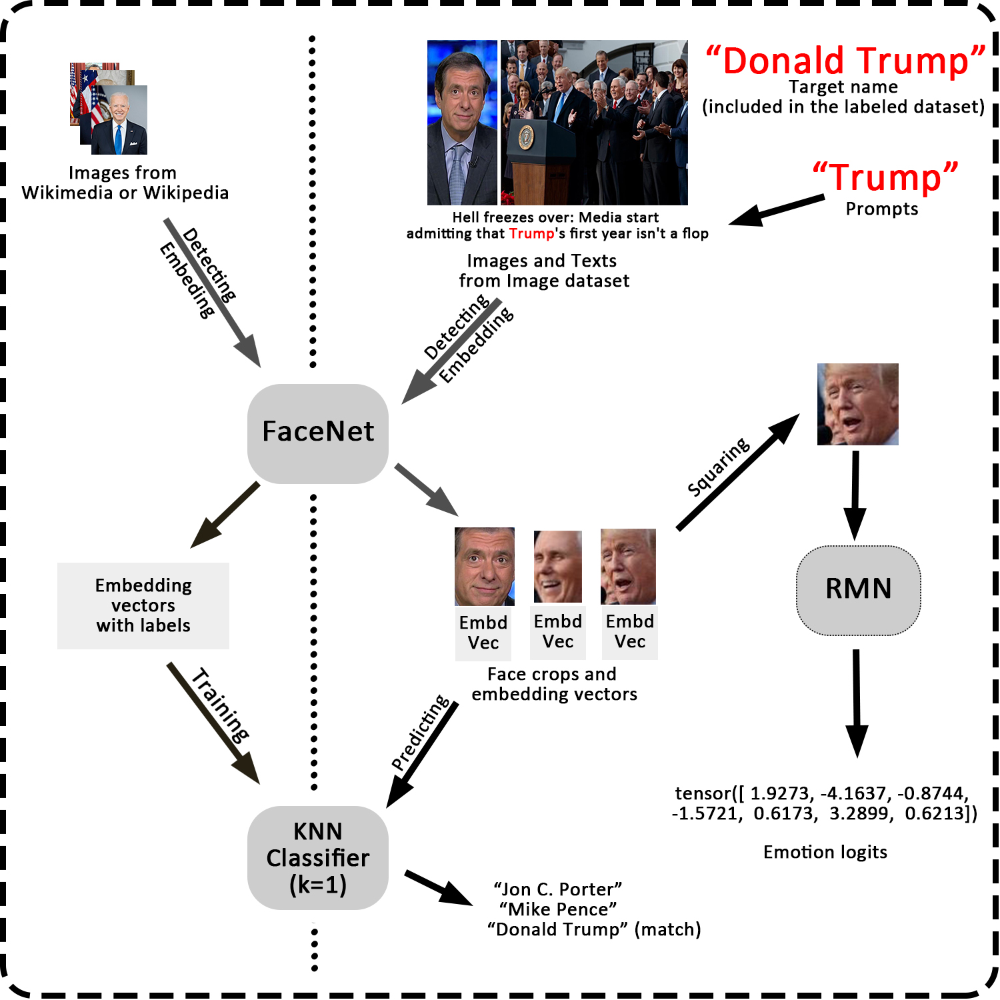

# Politician Image Project
Build up models to recognize the politicians in images from news websites.



### Install Packages
```
pip install numpy matplotlib pandas torch Pillow requests beautifulsoup4 facenet_pytorch rmn torchvision scikit-learn pickle-mixin tqdm
```
  
where 
  <ul>
  <li><code>facenet_pytorch</code> (<a href="https://github.com/timesler/facenet-pytorch">source</a>)): Key module for facial detection and recognition. </li>
  <li><code>rmn</code> (<a href="https://github.com/phamquiluan/ResidualMaskingNetwork">source</a>)): Key module for facial expression detection. </li>
  <li><code>request beautifulsoup4</code>: Extract content (links, texts, images) from website. </li>
  <li><code>scikit-learn</code>: K Nearest Neighbour classifier.</li>
  <li><code>pickle-mixin</code>: Save sklearn model.</li>
  </ul>


## Dataset
https://drive.google.com/file/d/1QWZ5JAdihzDzdTQX2Xjk4rFNm_ixurz7/view?usp=drive_link

## Analyze and processing the dataset
```
$ python analyze_image_dataset.py
```
Rename the columns. Delete lines with no URLs, invalid URLs, or duplicates.<br>
Determine the source corporation of each row by analyzing the URLs. Remove the rows from invalid or non-media corporation.

After processing, the sample size of dataset is **952705**, where the number of samples from each corporation is:

| Corporation     | Sample Size |
|-----------------|-------------|
| Politico        | 315248      |
| DailyCaller     | 145037      |
| WashTimes       | 114970      |
| FoxNews         | 101162      |
| CNN             | 94209       |
| NPR             | 92599       |
| Breitbart       | 81336       |
| APNews          | 7715        |
| PoliticoPro     | 236         |
| FoxBusiness     | 148         |
| TheHill         | 21          |
| WP              | 13          |
| TimesOfIsrael   | 3           |
| Mediaite        | 2           |
| WashingtonTimes | 2           |
| WSJ             | 1           |
| JNS             | 1           |
| JPost           | 1           |
| AFP             | 1           |


## Facenet Model preparation

### Steps
1. Prepare another labelled dataset:<br>
   Extract names and relevant image urls of politicians from the three Wikimedia sites:
   <ul>
     <li><a href="https://commons.wikimedia.org/wiki/Category:21st-century_male_politicians_of_the_United_States">Category:21st-century male politicians of the United States</a></li>
     <li><a href="https://commons.wikimedia.org/wiki/Category:21st-century_female_politicians_of_the_United_States">Category:21st-century female politicians of the United States</a></li>
     <li><a href="https://commons.wikimedia.org/w/index.php?title=Category:21st-century_businesspeople_from_the_United_States&oldid=527515279">Category: 21st-century businesspeople from the United States</a></li>
   </ul>

   and two Wikiopedia sites:
   <ul>
     <li><a href="https://en.wikipedia.org/w/index.php?title=Category:21st-century_American_politicians&oldid=1015022478">Category:21st-century American politicians</a></li>
     <li><a href="https://en.wikipedia.org/w/index.php?title=Category:21st-century_American_businesspeople&oldid=1110690935">Category:21st-century American businesspeople</a></li>     
   </ul>

Specifically, for each personal page from Wikipedia, first check if this person has wikimedia page, and get images from wikimedia page if possible. Otherwise, take the portrait link from the Wikipedia page if there is.

```
$ python Image_URLs.py
```

This execution takes around 48 hours, producing a map "name -> list of image urls" and storing as <code>name_img_url.pt</code> (around 61 MB), which includes 312587 urls from 20707 (in particular, 10094 non-empty) persons.<br>
This file is included in the repository. 


2. For the images from <code>name_img_url.pt</code>, implementing the <code>facenet</code> functions to get embedding vectors of faces.<br>
To reduce the execution time, for each person, we take at most 10 faces embedding vectors to this dataset, where one of which are from the portrait.
```
$ python Embedding_Faces.py
```
This execution takes around 9 hours, storing the labelled vectors as <code>name_embd.pt</code> (around 1.3 GB), which includes 37934 embedding face vectors from 9308 politicians.<br>
You may also download this file from https://drive.google.com/file/d/1SLuR20JKkM4EgpwZWJkGkSI3LXy0eBkc/view?usp=share_link

3. Using K-nearest neighbour classifier (with K=1) to produce a model for the labelled vectors.
```
$ python prepare_KNN_model.py
```


### Evaluation
1. Evaluate the performance of <code>facenet</code> model with the dataset <code>name_embd.pt</code>.
   Split the train, test set at a ratio 8:2, and then train a K-nearest neighbour classifier (with K=1) model.<br>
```
$ python Evaluate_name_embd.py
```
Output:
```
>>> The prediction accuracy of name_embd dataset through 1-nearest-neighbor is 0.8059839198629234.
```


2. Test the model using a single url:

#### Example 1:
We are interesting in the two persons from the image as follows <br>
<figure>

  <em>https://www.politico.com/dims4/default/210ea62/2147483647/strip/true/crop/700x400+0+0/resize/630x360!/quality/90/?url=https%3A%2F%2Fstatic.politico.com%2Fcapny%2Fsites%2Fdefault%2Ffiles%2Fa-Kirsten%20Gillibrand-Chuck%20Schumer_0.png</em>
</figure>

```
$ python test_url.py
```

Input:
```
https://www.politico.com/dims4/default/210ea62/2147483647/strip/true/crop/700x400+0+0/resize/630x360!/quality/90/?url=https%3A%2F%2Fstatic.politico.com%2Fcapny%2Fsites%2Fdefault%2Ffiles%2Fa-Kirsten%20Gillibrand-Chuck%20Schumer_0.png
```

Output:
```
>>> Recognized {'Kirsten Gillibrand', 'Charles Schumer'} in the image.
```
which are exactly the names of the two politicians.


#### Example 2
<figure>

  <em>US President <b>Donald Trump</b>, flanked by (from R) Response coordinator for White House Coronavirus Task Force <b>Deborah Birx</b>, US Treasury Secretary <b>Steven Mnuchin</b>, US Vice President <b>Mike Pence</b> and Director of the National Institute of Allergy and Infectious Diseases <b>Anthony Fauci</b>, speaks during the daily briefing on the novel coronavirus, COVID-19, in the Brady Briefing Room at the White House on March 25, 2020, in Washington, DC.</em>
</figure>

Input:
```
https://media.cnn.com/api/v1/images/stellar/prod/200505150639-02-coronavirus-task-force-briefing-0325.jpg?q=x_0,y_156,h_1688,w_3000,c_crop/w_800
```
Output:
```
Recognized {'Vicki Marble', 'Donald Trump', 'Mike Pence', 'Mike Gravel', 'Steven Mnuchin'} in the image.
```
Notice that 'Donald Trump', 'Mike Pence', 'Steven Mnuchin' are correctly predicted, while the other two failed, as they are not included in the dataset.

## Facial Expression Recognition (FER) model

### Source:
<a href="https://github.com/phamquiluan/ResidualMaskingNetwork">Residual Masking Network</a> from <a href="https://github.com/phamquiluan">Luan Pham</a>.


Implementing Residual Masking Network (RMN) for expression detection. Achieving 77% accuracy from <a href="https://www.kaggle.com/datasets/msambare/fer2013">FER2013</a> dataset.

For a face image, this model returns a logit vector of length 7, stands for <code>['Angry', 'Disgust', 'Fear', 'Happy', 'Sad', 'Surprise', 'Neutral']</code> expressions. We can then apply softmax function to get the corresponding probability.


## Obtained identity and expression data from the Media Dataset with prompts.
```
$ python name_emotion.py
```
Enter the exact name of a person we are interesting in (e.g. "Donald Trump"), the prompts (e.g. "Trump"), and the maximum number of values to get for each media corporationing.

This program filter out the samples whose texts (Title, Caption or Text) don't contain these prompts. 

Then for each of the corporation <code>[["foxnews", "foxbusiness"], ["cnn"], ["washtimes", "washingtontimes"], ["dailycaller"],["politico", "politicopro"], ["breitbart"], ["npr"], ['apnews']]</code>, with the facial recognition model <code>model.sav</code>, for each sample, the program determines whether or not the person is in the photos. If so, passing the square-cropped face to the emotion model, and get the logit vector. Store the result in <code>politician_emotions_corporation.pt</code>.


## Result
<div style="width: 100%; height: 30%; overflow: auto;">
<code>
Now analyzing the emotion from Joe Biden
cnn
Number of Samples: 2000
Average emotion: [0.5012, 0.1017, 0.0534, 0.0094, 0.2086, 0.0650, 0.0607]
Dominate Emotion: Angry
npr
Number of Samples: 1531
Average emotion: [0.4478, 0.0608, 0.0520, 0.0271, 0.2234, 0.1102, 0.0787]
Dominate Emotion: Angry
politico
Number of Samples: 2000
Average emotion: [0.4754, 0.0542, 0.0528, 0.0226, 0.1999, 0.1175, 0.0776]
Dominate Emotion: Angry
apnews
Number of Samples: 895
Average emotion: [0.4659, 0.0519, 0.0542, 0.0412, 0.1989, 0.1303, 0.0576]
Dominate Emotion: Angry
washtimes
Number of Samples: 2000
Average emotion: [0.4028, 0.0496, 0.0650, 0.0271, 0.2086, 0.1706, 0.0762]
Dominate Emotion: Angry
dailycaller
Number of Samples: 2000
Average emotion: [0.4467, 0.0560, 0.0707, 0.0270, 0.2255, 0.1083, 0.0657]
Dominate Emotion: Angry
foxnews
Number of Samples: 2000
Average emotion: [0.4004, 0.0602, 0.0445, 0.0205, 0.2678, 0.1027, 0.1039]
Dominate Emotion: Angry
breitbart
Number of Samples: 2000
Average emotion: [0.4365, 0.0383, 0.0553, 0.0368, 0.2116, 0.1462, 0.0752]
Dominate Emotion: Angry
Prediction Accuracy of KNN classification: 0.35763792625450513


Now analyzing the emotion from Donald Trump
cnn
Number of Samples: 2000
Average emotion: [0.7904, 0.0027, 0.0074, 0.0010, 0.0601, 0.0711, 0.0673]
Dominate Emotion: Angry
npr
Number of Samples: 2000
Average emotion: [0.6818, 0.0087, 0.0110, 0.0083, 0.1181, 0.0744, 0.0977]
Dominate Emotion: Angry
politico
Number of Samples: 2000
Average emotion: [0.7047, 0.0085, 0.0112, 0.0057, 0.1059, 0.0768, 0.0872]
Dominate Emotion: Angry
apnews
Number of Samples: 344
Average emotion: [0.7760, 0.0063, 0.0125, 0.0034, 0.1005, 0.0438, 0.0575]
Dominate Emotion: Angry
washtimes
Number of Samples: 2000
Average emotion: [0.7170, 0.0086, 0.0099, 0.0059, 0.1034, 0.0722, 0.0831]
Dominate Emotion: Angry
dailycaller
Number of Samples: 2000
Average emotion: [0.6980, 0.0104, 0.0110, 0.0081, 0.1338, 0.0496, 0.0891]
Dominate Emotion: Angry
foxnews
Number of Samples: 2000
Average emotion: [0.7116, 0.0060, 0.0070, 0.0067, 0.0938, 0.0613, 0.1135]
Dominate Emotion: Angry
breitbart
Number of Samples: 2000
Average emotion: [0.6883, 0.0105, 0.0099, 0.0094, 0.1615, 0.0342, 0.0861]
Dominate Emotion: Angry
Prediction Accuracy of KNN classification: 0.33351924149470163


Now analyzing the emotion from Barack Obama
cnn
Number of Samples: 529
Average emotion: [0.5045, 0.0285, 0.0108, 0.0709, 0.1817, 0.0609, 0.1427]
Dominate Emotion: Angry
npr
Number of Samples: 1095
Average emotion: [0.4365, 0.0162, 0.0091, 0.0751, 0.2040, 0.0614, 0.1977]
Dominate Emotion: Angry
politico
Number of Samples: 2000
Average emotion: [0.4546, 0.0210, 0.0103, 0.0639, 0.2056, 0.0635, 0.1812]
Dominate Emotion: Angry
apnews
Number of Samples: 39
Average emotion: [0.1458, 0.0214, 0.0117, 0.7098, 0.0304, 0.0648, 0.0161]
Dominate Emotion: Happy
washtimes
Number of Samples: 1373
Average emotion: [0.4382, 0.0209, 0.0106, 0.0677, 0.2240, 0.0605, 0.1782]
Dominate Emotion: Angry
dailycaller
Number of Samples: 1775
Average emotion: [0.3987, 0.0191, 0.0089, 0.0933, 0.2287, 0.0500, 0.2012]
Dominate Emotion: Angry
foxnews
Number of Samples: 517
Average emotion: [0.4696, 0.0149, 0.0068, 0.0444, 0.2141, 0.0468, 0.2033]
Dominate Emotion: Angry
breitbart
Number of Samples: 293
Average emotion: [0.5407, 0.0183, 0.0099, 0.0973, 0.1350, 0.0645, 0.1342]
Dominate Emotion: Angry
Prediction Accuracy of KNN classification: 0.40293809024134314


Now analyzing the emotion from Hillary Clinton
cnn
Number of Samples: 524
Average emotion: [0.0901, 0.0052, 0.0235, 0.3158, 0.1534, 0.2296, 0.1823]
Dominate Emotion: Happy
npr
Number of Samples: 1243
Average emotion: [0.0602, 0.0039, 0.0287, 0.4460, 0.1042, 0.2716, 0.0854]
Dominate Emotion: Happy
politico
Number of Samples: 2000
Average emotion: [0.0940, 0.0047, 0.0259, 0.3171, 0.1242, 0.3055, 0.1285]
Dominate Emotion: Happy
apnews
Number of Samples: 2
Average emotion: [0.0001, 0.0000, 0.0000, 0.9966, 0.0001, 0.0031, 0.0000]
Dominate Emotion: Happy
washtimes
Number of Samples: 1416
Average emotion: [0.1172, 0.0049, 0.0252, 0.2920, 0.1147, 0.3288, 0.1172]
Dominate Emotion: Surprise
dailycaller
Number of Samples: 2000
Average emotion: [0.1089, 0.0049, 0.0313, 0.3226, 0.1131, 0.3122, 0.1070]
Dominate Emotion: Happy
foxnews
Number of Samples: 912
Average emotion: [0.1005, 0.0045, 0.0208, 0.4064, 0.1032, 0.2480, 0.1166]
Dominate Emotion: Happy
breitbart
Number of Samples: 283
Average emotion: [0.0683, 0.0047, 0.0265, 0.3793, 0.0760, 0.3676, 0.0776]
Dominate Emotion: Happy
Prediction Accuracy of KNN classification: 0.43627684964200475


Now analyzing the emotion from Kevin McCarthy
cnn
Number of Samples: 148
Average emotion: [0.3932, 0.0136, 0.0074, 0.0033, 0.2513, 0.0453, 0.2860]
Dominate Emotion: Angry
npr
Number of Samples: 186
Average emotion: [0.3936, 0.0366, 0.0118, 0.0240, 0.1219, 0.0998, 0.3123]
Dominate Emotion: Angry
politico
Number of Samples: 802
Average emotion: [0.4227, 0.0513, 0.0136, 0.0091, 0.1409, 0.0919, 0.2706]
Dominate Emotion: Angry
apnews
Number of Samples: 58
Average emotion: [0.5187, 0.0222, 0.0059, 0.0053, 0.0498, 0.1168, 0.2813]
Dominate Emotion: Angry
washtimes
Number of Samples: 330
Average emotion: [0.3231, 0.0251, 0.0215, 0.0080, 0.1636, 0.1841, 0.2744]
Dominate Emotion: Angry
dailycaller
Number of Samples: 591
Average emotion: [0.4223, 0.0260, 0.0086, 0.0091, 0.1870, 0.0571, 0.2898]
Dominate Emotion: Angry
foxnews
Number of Samples: 1296
Average emotion: [0.2283, 0.0015, 0.0010, 0.0016, 0.0503, 0.3035, 0.4137]
Dominate Emotion: Neutral
breitbart
Number of Samples: 287
Average emotion: [0.3873, 0.0266, 0.0121, 0.0054, 0.2321, 0.0610, 0.2754]
Dominate Emotion: Angry
Prediction Accuracy of KNN classification: 0.5978378378378378


Now analyzing the emotion from Kamala Harris
cnn
Number of Samples: 520
Average emotion: [0.1078, 0.0109, 0.0174, 0.2649, 0.1336, 0.2337, 0.2316]
Dominate Emotion: Happy
npr
Number of Samples: 241
Average emotion: [0.0715, 0.0081, 0.0327, 0.3889, 0.0952, 0.3046, 0.0990]
Dominate Emotion: Happy
politico
Number of Samples: 958
Average emotion: [0.0769, 0.0077, 0.0290, 0.2547, 0.0978, 0.3902, 0.1439]
Dominate Emotion: Surprise
apnews
Number of Samples: 70
Average emotion: [0.1085, 0.0133, 0.0267, 0.2477, 0.1348, 0.2634, 0.2056]
Dominate Emotion: Surprise
washtimes
Number of Samples: 440
Average emotion: [0.0618, 0.0062, 0.0425, 0.1731, 0.0853, 0.4876, 0.1435]
Dominate Emotion: Surprise
dailycaller
Number of Samples: 871
Average emotion: [0.0850, 0.0111, 0.0355, 0.2183, 0.1212, 0.3615, 0.1674]
Dominate Emotion: Surprise
foxnews
Number of Samples: 1444
Average emotion: [0.0125, 0.0033, 0.0216, 0.4368, 0.0245, 0.4639, 0.0374]
Dominate Emotion: Surprise
breitbart
Number of Samples: 544
Average emotion: [0.1137, 0.0092, 0.0451, 0.1799, 0.1094, 0.3956, 0.1471]
Dominate Emotion: Surprise
Prediction Accuracy of KNN classification: 0.5204402515723271


Now analyzing the emotion from Elon Musk
cnn
Number of Samples: 3
Average emotion: [0.1005, 0.0005, 0.0006, 0.0006, 0.0128, 0.0540, 0.8310]
Dominate Emotion: Neutral
npr
Number of Samples: 14
Average emotion: [0.0383, 0.0073, 0.0025, 0.1160, 0.0243, 0.1816, 0.6301]
Dominate Emotion: Neutral
politico
Number of Samples: 198
Average emotion: [0.0824, 0.0019, 0.0051, 0.0369, 0.0360, 0.2057, 0.6319]
Dominate Emotion: Neutral
apnews
Number of Samples: 4
Average emotion: [0.4646, 0.0151, 0.0030, 0.0178, 0.0409, 0.0061, 0.4525]
Dominate Emotion: Angry
washtimes
Number of Samples: 73
Average emotion: [0.0446, 0.0011, 0.0050, 0.0651, 0.0148, 0.4098, 0.4595]
Dominate Emotion: Neutral
dailycaller
Number of Samples: 92
Average emotion: [0.0514, 0.0103, 0.0056, 0.3651, 0.0314, 0.2037, 0.3325]
Dominate Emotion: Happy
foxnews
Number of Samples: 116
Average emotion: [0.0773, 0.0053, 0.0033, 0.1517, 0.0399, 0.1200, 0.6026]
Dominate Emotion: Neutral
breitbart
Number of Samples: 273
Average emotion: [0.1113, 0.0097, 0.0063, 0.1559, 0.0709, 0.2163, 0.4295]
Dominate Emotion: Neutral
Prediction Accuracy of KNN classification: 0.5979381443298969


Now analyzing the emotion from Mike Pence
cnn
Number of Samples: 411
Average emotion: [0.8142, 0.0151, 0.0017, 0.0007, 0.0874, 0.0017, 0.0791]
Dominate Emotion: Angry
npr
Number of Samples: 435
Average emotion: [0.7056, 0.0345, 0.0055, 0.0098, 0.1188, 0.0081, 0.1175]
Dominate Emotion: Angry
politico
Number of Samples: 1432
Average emotion: [0.6993, 0.0438, 0.0068, 0.0051, 0.1234, 0.0102, 0.1113]
Dominate Emotion: Angry
apnews
Number of Samples: 80
Average emotion: [0.6607, 0.0159, 0.0063, 0.0098, 0.1295, 0.0125, 0.1652]
Dominate Emotion: Angry
washtimes
Number of Samples: 739
Average emotion: [0.7151, 0.0367, 0.0048, 0.0065, 0.1033, 0.0070, 0.1266]
Dominate Emotion: Angry
dailycaller
Number of Samples: 958
Average emotion: [0.6730, 0.0296, 0.0058, 0.0074, 0.1407, 0.0060, 0.1375]
Dominate Emotion: Angry
foxnews
Number of Samples: 2000
Average emotion: [0.9197, 0.0020, 0.0010, 0.0003, 0.0303, 0.0007, 0.0461]
Dominate Emotion: Angry
breitbart
Number of Samples: 227
Average emotion: [0.7533, 0.0348, 0.0044, 0.0041, 0.1106, 0.0054, 0.0875]
Dominate Emotion: Angry
Prediction Accuracy of KNN classification: 0.5970719287078294


Now analyzing the emotion from Jeff Bezos
cnn
Number of Samples: 0
npr
Number of Samples: 18
Average emotion: [0.1205, 0.0312, 0.0366, 0.3552, 0.0694, 0.2326, 0.1546]
Dominate Emotion: Happy
politico
Number of Samples: 70
Average emotion: [0.1638, 0.0163, 0.0208, 0.0603, 0.1169, 0.1511, 0.4709]
Dominate Emotion: Neutral
apnews
Number of Samples: 0
washtimes
Number of Samples: 23
Average emotion: [0.2483, 0.0077, 0.0208, 0.0548, 0.0737, 0.2126, 0.3820]
Dominate Emotion: Neutral
dailycaller
Number of Samples: 26
Average emotion: [0.2170, 0.0094, 0.0151, 0.0923, 0.1165, 0.1562, 0.3935]
Dominate Emotion: Neutral
foxnews
Number of Samples: 30
Average emotion: [0.0765, 0.0155, 0.0071, 0.5329, 0.0339, 0.1215, 0.2126]
Dominate Emotion: Happy
breitbart
Number of Samples: 43
Average emotion: [0.0919, 0.0087, 0.0179, 0.4209, 0.0360, 0.2741, 0.1505]
Dominate Emotion: Happy
Prediction Accuracy of KNN classification: 0.4528301886792453


Now analyzing the emotion from Bill Gates
cnn
Number of Samples: 0
npr
Number of Samples: 5
Average emotion: [0.0740, 0.0449, 0.0089, 0.2947, 0.2033, 0.0651, 0.3091]
Dominate Emotion: Neutral
politico
Number of Samples: 22
Average emotion: [0.0681, 0.1316, 0.0532, 0.1180, 0.1593, 0.1697, 0.3001]
Dominate Emotion: Neutral
apnews
Number of Samples: 4
Average emotion: [0.3356, 0.0063, 0.0411, 0.0005, 0.2738, 0.1822, 0.1605]
Dominate Emotion: Angry
washtimes
Number of Samples: 23
Average emotion: [0.0505, 0.0337, 0.0536, 0.2193, 0.1515, 0.2447, 0.2466]
Dominate Emotion: Neutral
dailycaller
Number of Samples: 23
Average emotion: [0.0711, 0.0111, 0.0160, 0.3157, 0.1124, 0.1739, 0.2998]
Dominate Emotion: Happy
foxnews
Number of Samples: 4
Average emotion: [0.1337, 0.0045, 0.0972, 0.0025, 0.3907, 0.1866, 0.1847]
Dominate Emotion: Sad
breitbart
Number of Samples: 35
Average emotion: [0.0357, 0.0024, 0.0074, 0.4798, 0.0645, 0.1711, 0.2391]
Dominate Emotion: Happy
Prediction Accuracy of KNN classification: 0.41379310344827586


Now analyzing the emotion from Nancy Pelosi
cnn
Number of Samples: 737
Average emotion: [0.0166, 0.0051, 0.0743, 0.1050, 0.0562, 0.6904, 0.0525]
Dominate Emotion: Surprise
npr
Number of Samples: 304
Average emotion: [0.0318, 0.0040, 0.0625, 0.1148, 0.0991, 0.5800, 0.1078]
Dominate Emotion: Surprise
politico
Number of Samples: 1603
Average emotion: [0.0333, 0.0046, 0.0718, 0.0703, 0.1063, 0.6078, 0.1058]
Dominate Emotion: Surprise
apnews
Number of Samples: 124
Average emotion: [0.0550, 0.0067, 0.0454, 0.2640, 0.2017, 0.3370, 0.0902]
Dominate Emotion: Surprise
washtimes
Number of Samples: 1833
Average emotion: [0.0190, 0.0030, 0.0702, 0.0596, 0.0545, 0.7268, 0.0668]
Dominate Emotion: Surprise
dailycaller
Number of Samples: 2000
Average emotion: [0.0226, 0.0053, 0.1016, 0.0750, 0.0794, 0.6544, 0.0616]
Dominate Emotion: Surprise
foxnews
Number of Samples: 886
Average emotion: [0.0249, 0.0039, 0.0757, 0.0772, 0.0585, 0.6727, 0.0872]
Dominate Emotion: Surprise
breitbart
Number of Samples: 773
Average emotion: [0.0164, 0.0034, 0.0859, 0.0943, 0.0624, 0.6814, 0.0561]
Dominate Emotion: Surprise
Prediction Accuracy of KNN classification: 0.4648910411622276
</code>
</div>


